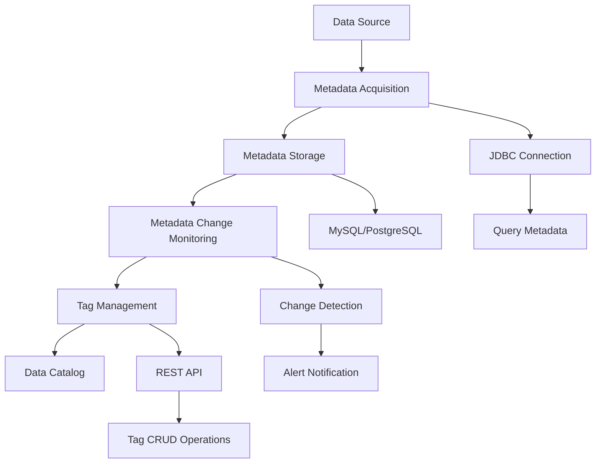

# Data Catalog

Data catalog is one of the core features of DataVines, designed to build and maintain metadata information for data assets, helping users better understand and manage their data. This module builds a data catalog by periodically retrieving metadata from data sources and supports real-time monitoring of metadata changes to ensure the timeliness and accuracy of the catalog. Additionally, the data catalog supports tag management, allowing users to add tags to metadata for easier classification and retrieval.

## Business Value and Use Cases

The business value of data catalog is primarily reflected in the following aspects:

### Data Asset Management

By centrally managing metadata information from data sources, organizations can establish a unified view of data assets, improving data visibility and manageability. The data catalog serves as a single source of truth for understanding what data exists, where it's located, and how it's structured.

### Data Discovery and Exploration

Users can quickly search for and understand the required data tables and field information through the data catalog, improving data utilization efficiency. This accelerates the time from data discovery to insights, enabling faster decision-making.

### Data Governance

Supporting metadata change monitoring helps promptly identify and handle changes in data structure, ensuring data consistency and integrity. This is crucial for maintaining data quality standards and regulatory compliance.

### Compliance Support

Through tag management, sensitive data can be marked, facilitating the implementation of data security policies and meeting compliance requirements such as GDPR, CCPA, and industry-specific regulations.

## Typical Use Cases

### Data Lake/Data Warehouse Management

In large-scale data environments, the data catalog helps administrators and analysts quickly locate and understand data assets. It provides a comprehensive view of all available data, making it easier to manage and govern large data repositories.

### Data Migration and Integration

During data migration or integration processes, the data catalog serves as a reference to ensure data structure consistency. It helps track schema changes and maintains data lineage across different systems.

### Data Sharing and Collaboration

Team members can share data information through the data catalog, promoting cross-departmental data collaboration. This breaks down data silos and enables better coordination between teams.

## Technical Implementation

The technical implementation of the data catalog includes the following key components:

### Metadata Acquisition

Implemented through the `CatalogMetaDataFetchTaskRunner` class, which implements the `Runnable` interface and is responsible for executing metadata acquisition tasks. The specific logic is defined in `CatalogMetaDataFetchExecutorImpl`, which:

- Connects to data sources via JDBC
- Executes metadata query statements
- Retrieves table structures, field information, and other metadata

The metadata acquisition process runs periodically to keep the catalog up-to-date.

### Metadata Storage

Retrieved metadata is stored in DataVines' database, typically using MySQL or PostgreSQL as the backend storage. Metadata information includes:

- Table names
- Column names
- Data types
- Comments and descriptions
- Primary and foreign key relationships
- Indexes and constraints

### Metadata Change Monitoring

Through scheduled tasks, metadata acquisition tasks are periodically executed to compare differences between new and old metadata. Change history is recorded, which can:

- Trigger alerts when schema changes are detected
- Notify relevant personnel about structural modifications
- Maintain a complete audit trail of metadata changes
- Support impact analysis for schema evolution

### Tag Management

Implemented through the `CatalogTagController` class, which provides REST API interfaces supporting:

- Creating tags with custom names and descriptions
- Updating existing tags
- Deleting tags
- Applying tags to tables, columns, and other metadata objects
- Searching and filtering by tags

Tags help users classify and manage data according to business domains, sensitivity levels, data quality, or any custom categorization scheme.

## Architecture Diagram

The following diagram illustrates the data catalog workflow:

## Key Features

### Automated Metadata Collection

- **Scheduled Tasks**: Automatically collect metadata at configurable intervals
- **Multi-Source Support**: Connect to various data sources including MySQL, PostgreSQL, ClickHouse, Doris, StarRocks, and more
- **Incremental Updates**: Only update changed metadata to optimize performance

### Comprehensive Metadata View

- **Schema Information**: Complete table and column definitions
- **Data Types**: Detailed data type information for all columns
- **Relationships**: Primary keys, foreign keys, and table relationships
- **Statistics**: Row counts, data size, and other statistical information

### Change Tracking

- **Version History**: Maintain complete history of metadata changes
- **Change Notifications**: Alert stakeholders when schemas change
- **Impact Analysis**: Understand the impact of schema changes on downstream systems

### Flexible Tag System

- **Custom Tags**: Create domain-specific tags for your organization
- **Hierarchical Organization**: Organize tags in logical hierarchies
- **Search and Filter**: Quickly find data assets using tag-based search
- **Access Control**: Mark sensitive data for security and compliance

## Best Practices

### Regular Metadata Updates

Schedule metadata collection tasks at appropriate intervals based on your data change frequency. For frequently changing environments, consider hourly or daily updates. For stable environments, weekly updates may suffice.

### Meaningful Tag Strategy

Develop a consistent tagging strategy across your organization:

- Use domain tags to organize data by business area
- Apply sensitivity tags (public, internal, confidential) for security
- Mark data quality levels to help users assess trustworthiness
- Tag data sources by system of origin

### Documentation and Comments

Enrich metadata with clear descriptions and comments:

- Add business definitions to tables and columns
- Document data lineage and transformation logic
- Note data quality issues or known limitations
- Include contact information for data owners

### Integration with Data Quality

Leverage the data catalog in conjunction with data quality checks:

- Use catalog metadata to configure quality rules
- Monitor for schema changes that might affect quality checks
- Document quality check results in the catalog

## Getting Started

To start using the data catalog feature:

1. **Configure Data Sources**: Add your data sources through the web interface
2. **Schedule Metadata Collection**: Set up periodic metadata collection tasks
3. **Create Tag Taxonomy**: Define tags relevant to your organization
4. **Apply Tags**: Classify your data assets with appropriate tags
5. **Monitor Changes**: Set up alerts for schema changes
6. **Explore**: Use the catalog to discover and understand your data

For detailed configuration instructions, refer to the [Connector Documentation](./02-connector/01-connector-mysql.md).
