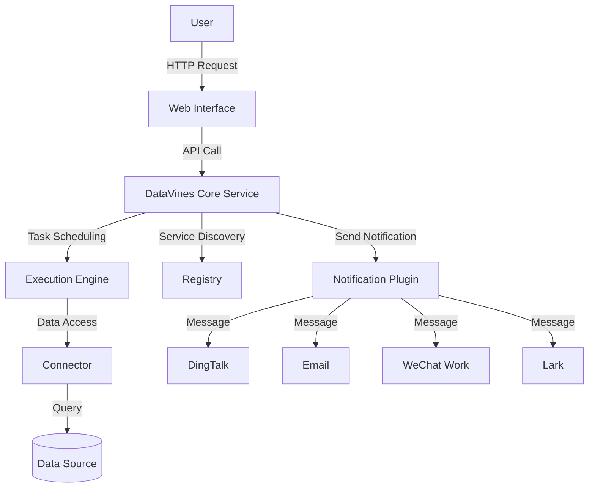
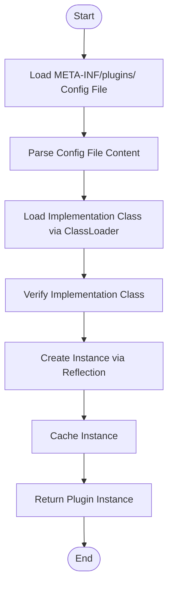
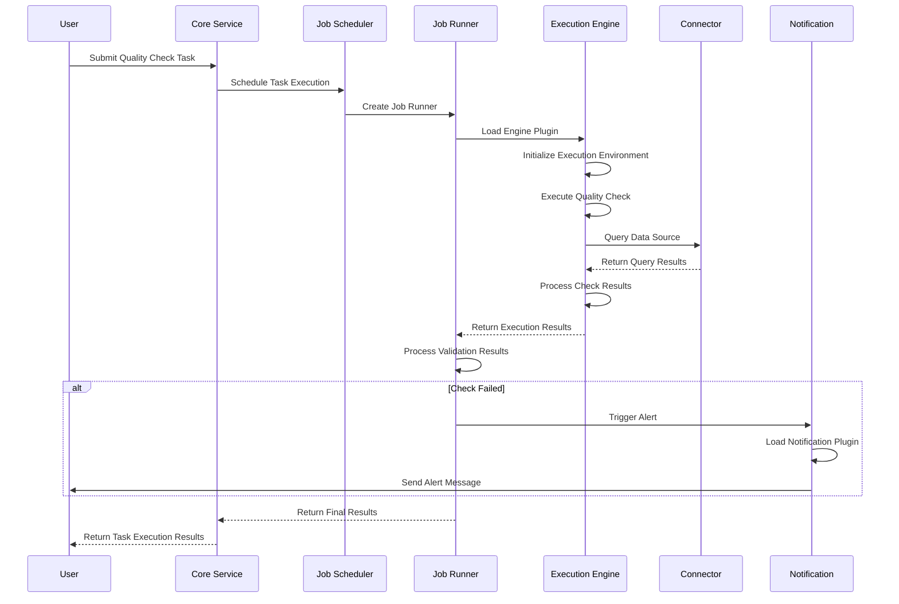
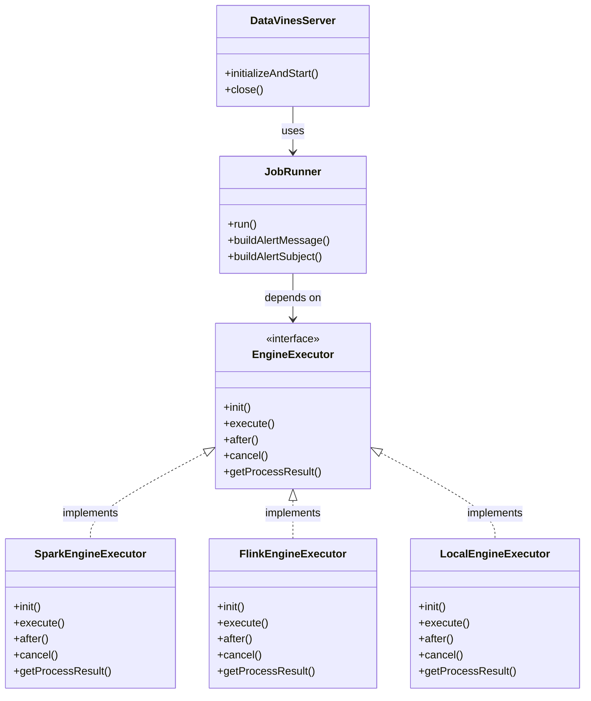
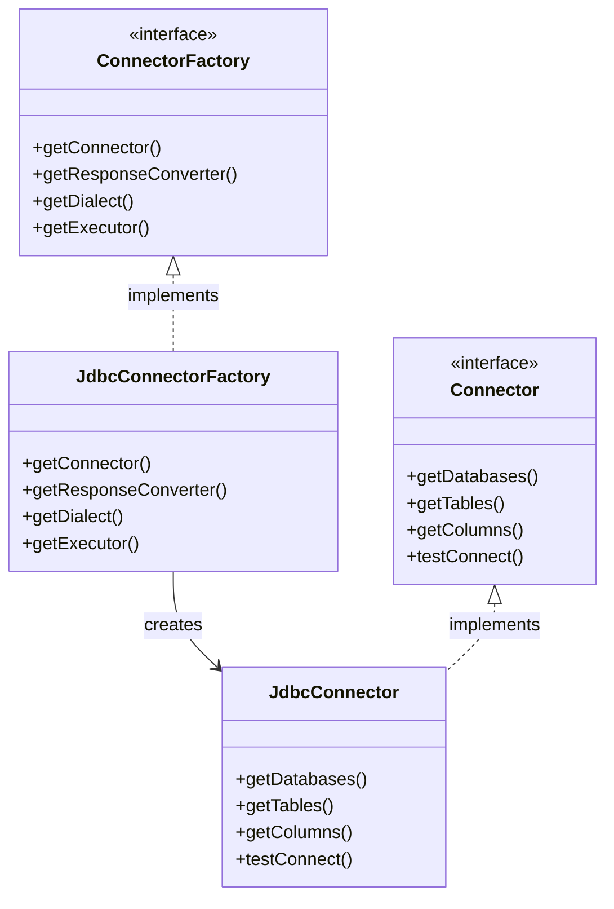
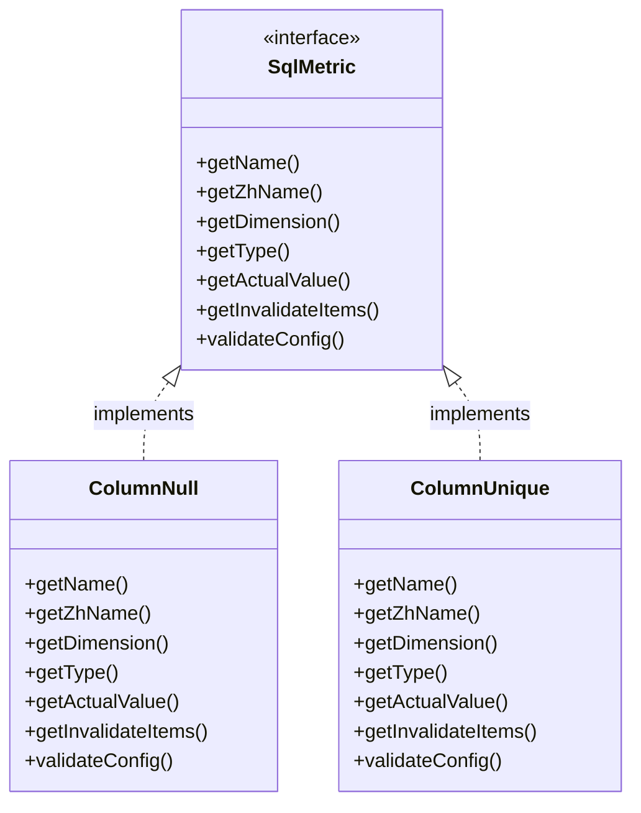

# Architecture Design

## Introduction

DataVines is a data quality monitoring platform that adopts a microkernel architecture design, implementing a highly extensible plugin system through the SPI (Service Provider Interface) mechanism. This architecture decouples core services from specific implementations, supporting dynamic expansion of multiple execution engines, connectors, and notification methods. The system primarily consists of core services (Server), execution engines (Engine), connectors (Connector), and plugin systems (SPI). Components interact through well-defined interfaces, achieving high cohesion and loose coupling design principles.

## System Context Diagram

The following diagram shows the overall system context and interactions between major components:

## Microkernel Architecture Overview

DataVines adopts the microkernel architecture pattern, dividing the system into two main parts: the core kernel and extensible plugins. The core kernel is responsible for basic services, task scheduling, and lifecycle management, while specific functionalities such as data source connections, execution engines, quality metrics, and notification methods are implemented as plugins.

Key characteristics of this architecture:

- **High Extensibility**: Plugins are dynamically loaded through the SPI mechanism, supporting new data sources or execution engines without modifying core code
- **Loose Coupling**: Core services and plugins communicate through interfaces, reducing dependencies between components
- **Easy Maintenance**: Plugins can be independently developed, tested, and deployed, facilitating team collaboration
- **Flexibility**: Users can select and configure different plugin combinations according to their needs

The core kernel mainly consists of the Server module, responsible for receiving user requests, scheduling task execution, and managing plugin lifecycles. The plugin system is distributed across Connector, Engine, Metric, and Notification modules, each defining standard interfaces with specific implementations as plugins.

## Core Components Analysis

### Core Service (Server)

The core service is the control center of DataVines, built on the Spring Boot framework, responsible for system initialization, task scheduling, and lifecycle management. In the `DataVinesServer` class, system initialization is completed through the `@PostConstruct` annotated method `initializeAndStart()`, including:

- Initialize common property configuration
- Start job execution manager (JobExecuteManager)
- Initialize registry
- Start registration service (Register)
- Start job scheduler (JobScheduler)

The core service obtains components such as Spring application context, environment configuration, and registry holder through dependency injection, demonstrating the application of dependency injection design pattern.

### Execution Engine (Engine)

The execution engine is responsible for specific task execution, defining the `EngineExecutor` interface as the abstract base class for all execution engines. This interface includes methods such as `init()`, `execute()`, and `after()`, standardizing the lifecycle of execution engines. Different execution engines (such as Spark, Flink, Local, etc.) provide specific execution logic by implementing this interface.

The creation and management of execution engines are implemented through the SPI mechanism, with the system dynamically loading corresponding executor instances based on the engine type in task configuration.

### Connector

Connectors are responsible for interacting with various data sources, providing a unified data access interface. The `Connector` interface defines methods for obtaining databases, tables, columns, and other metadata, as well as connection testing functionality. Through the `ConnectorFactory` factory interface, the system can create specific types of connector instances.

Connector plugins support multiple database types, including MySQL, Oracle, PostgreSQL, ClickHouse, etc., with each database type having a corresponding connector implementation.

### Plugin System (SPI)

SPI (Service Provider Interface) is the core mechanism of DataVines' plugin architecture. By marking interfaces with the `@SPI` annotation, the system can dynamically discover and load implementation classes. The `PluginLoader` class is the concrete implementation of the SPI mechanism, responsible for plugin loading, caching, and instantiation.

## SPI Plugin Mechanism

### Class Loading and Service Discovery

DataVines' SPI mechanism is based on Java's ServiceLoader pattern with extensions and optimizations. The `PluginLoader` class is the core of plugin loading, working as follows:

1. **Plugin Discovery**: The system searches for configuration files named after interface fully qualified names in the `META-INF/plugins/` directory
2. **Class Loading**: Reads implementation class fully qualified names from configuration files and loads classes through the class loader
3. **Instantiation**: Creates instances of implementation classes through reflection
4. **Cache Management**: Uses ConcurrentHashMap to cache loaded plugin classes and instances, improving performance

The plugin loading process:

### Instantiation Process

The plugin instantiation process is controlled by `PluginLoader`'s `getOrCreatePlugin()` and `getNewPlugin()` methods:

- `getOrCreatePlugin()`: Gets singleton instance, returning the same instance on multiple calls
- `getNewPlugin()`: Gets new instance, creating a new instance on each call

This design supports both stateful plugins (requiring new instances) and stateless plugins (shareable instances), providing flexible instantiation strategies.

### Plugin Lifecycle

The plugin lifecycle is uniformly managed by core services:

1. **Loading Phase**: System scans and loads all plugins at startup
2. **Initialization Phase**: Creates plugin instances and performs initialization as needed
3. **Running Phase**: Plugins process specific business logic
4. **Destruction Phase**: Releases plugin resources when system shuts down

## Task Scheduling Flow

The complete lifecycle from user request to result return:

### Detailed Flow Description

1. **Request Reception**: Users submit quality check tasks through the web interface or API
2. **Task Scheduling**: Core service hands tasks to the job scheduler for scheduling
3. **Executor Creation**: Job runner (JobRunner) is created, responsible for specific task execution
4. **Engine Loading**: Loads corresponding execution engine through SPI mechanism based on engine type in task configuration
5. **Execution Initialization**: Execution engine initializes execution environment and prepares required resources
6. **Task Execution**: Execution engine executes quality check logic, including SQL generation, execution, and result processing
7. **Result Validation**: Checks if execution results meet expectations, determining task success or failure
8. **Notification Processing**: Triggers alert notification process if check fails, sending messages through notification plugins
9. **Result Return**: Returns final execution results to users

## Component Interaction Patterns

### Core Service and Execution Engine

Core services interact with execution engines through the `EngineExecutor` interface. Core services don't care about specific engine implementation details, only needing to call standard interface methods to complete task execution.

### Connector and Data Source

The connector component adopts a combination of factory pattern and strategy pattern. `ConnectorFactory` serves as the factory interface, responsible for creating specific connector instances; `Connector` serves as the strategy interface, defining unified data access methods.

### Quality Metrics and Validation

The quality metrics system defines standardized quality check rules through the `SqlMetric` interface. Each specific check rule (such as null check, uniqueness check, etc.) implements this interface.

## Technical Decisions and Trade-offs

### Microkernel Architecture Choice

The microkernel architecture was chosen primarily to meet the data quality platform's high requirements for extensibility. This architecture brings the following advantages:

- **Flexibility**: Easy to add new data source support without modifying core code
- **Maintainability**: Plugins can be independently developed and tested, reducing system complexity
- **Deployability**: Specific plugins can be selectively deployed as needed, reducing deployment package size

However, this architecture also brings some challenges:

- **Performance Overhead**: Plugin loading and reflection calls introduce some performance overhead
- **Debugging Complexity**: Plugins are dynamically loaded at runtime, increasing debugging difficulty
- **Version Compatibility**: Need to ensure API compatibility between core services and plugins

### SPI Mechanism Design

The SPI mechanism design considers the following factors:

- **Performance Optimization**: Avoids repeated loading through caching of loaded plugin classes and instances
- **Thread Safety**: Uses thread-safe data structures like ConcurrentHashMap to ensure safety in multi-threaded environments
- **Error Handling**: Provides detailed error information for troubleshooting plugin loading issues
- **Extensibility**: Supports dynamic plugin addition and replacement for testing and development

### Registry Integration

The system supports multiple registry implementations (such as ZooKeeper, MySQL) by abstracting registry specifics through the `Registry` interface. This design allows users to choose appropriate registries based on infrastructure, improving system adaptability.

## Extensibility, Reliability, and Performance Design

### Extensibility Design

DataVines' extensibility is primarily reflected in the following aspects:

1. **Horizontal Scaling**: Supports multi-node deployment through registry for load balancing
2. **Feature Extension**: Supports new execution engines, connectors, quality metrics, and notification methods through SPI mechanism
3. **Configuration Extension**: Supports different deployment environments and requirements through flexible configuration system

### Reliability Design

System reliability is guaranteed through the following mechanisms:

- **Failover**: Supports failover and retry mechanisms when job execution fails
- **Resource Management**: Properly manages resources like database connections to avoid resource leaks
- **Exception Handling**: Comprehensive exception handling ensures graceful degradation in exceptional situations
- **Logging**: Detailed logging for troubleshooting and auditing

### Performance Considerations

The system has made the following optimizations for performance:

- **Connection Pooling**: Uses high-performance connection pools like HikariCP to manage database connections
- **Caching**: Caches frequently accessed data (such as plugin information, metadata, etc.)
- **Asynchronous Processing**: Asynchronizes time-consuming operations like notification sending to improve response speed
- **Batch Processing**: Supports batch task execution to improve processing efficiency

These design considerations ensure DataVines' high performance and high availability in large-scale data quality monitoring scenarios.

## Conclusion

Through microkernel architecture and SPI plugin mechanism, DataVines has built a highly extensible, flexible, and reliable data quality monitoring platform. The clear boundary design between core services and plugins enables the system to meet current needs while having good future expansion capabilities. The task scheduling flow design ensures complete lifecycle management from user request to result return, while component interaction patterns embody high cohesion and loose coupling design principles.

The successful implementation of this architecture provides an excellent reference case for the data quality monitoring field, and its design philosophy and implementation techniques have important reference value for the development of similar systems.
