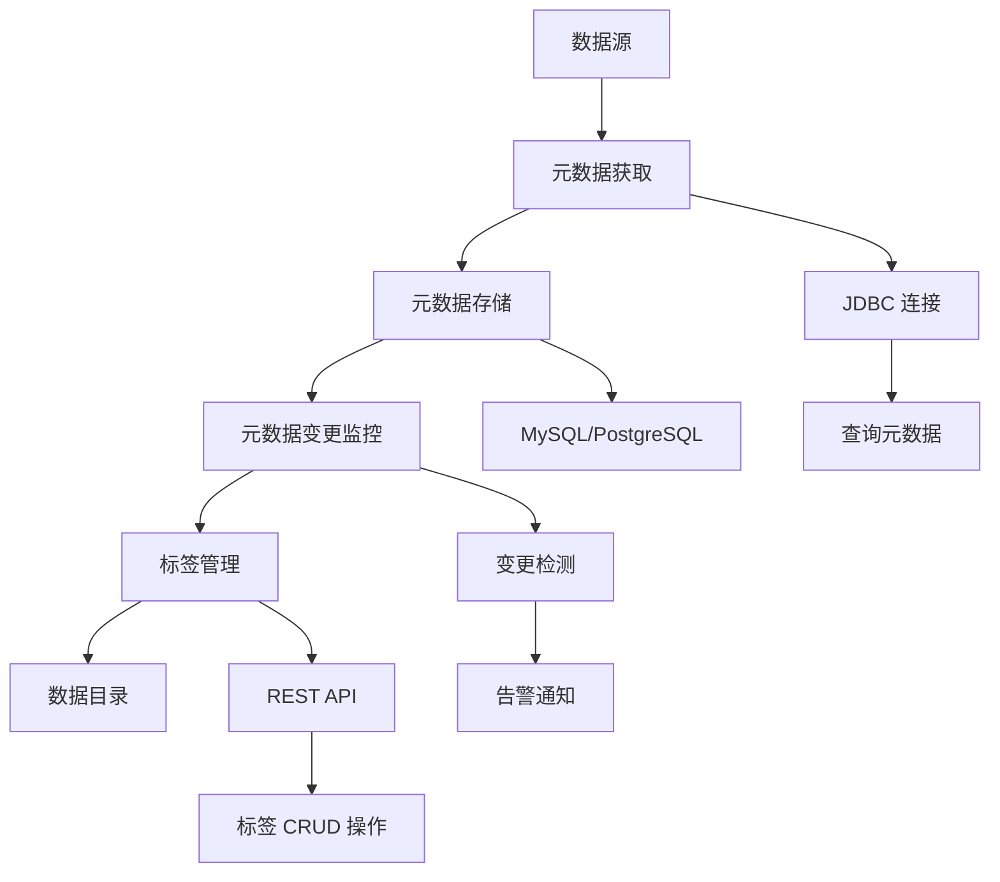

# 数据目录

数据目录是 DataVines 的核心功能之一，旨在构建和维护数据资产的元数据信息，帮助用户更好地理解和管理数据。该模块通过定期获取数据源的元数据来构建数据目录，并支持实时监听元数据变更情况，确保数据目录的实时性和准确性。此外，数据目录还支持标签管理，允许用户为元数据添加标签，以便于分类和检索。

## 业务价值与使用场景

数据目录的业务价值主要体现在以下几个方面：

### 数据资产管理

通过集中管理数据源的元数据信息，帮助组织建立统一的数据资产视图，提升数据的可见性和可管理性。数据目录作为单一真实来源，帮助用户了解存在哪些数据、数据位于哪里以及数据的结构如何。

### 数据发现与探索

用户可以通过数据目录快速查找和了解所需的数据表及其字段信息，提高数据使用的效率。这加速了从数据发现到洞察的时间，使得决策制定更加迅速。

### 数据治理

支持元数据变更监控，有助于及时发现和处理数据结构的变化，保障数据的一致性和完整性。这对于维护数据质量标准和满足合规要求至关重要。

### 合规性支持

通过标签管理，可以对敏感数据进行标记，便于实施数据安全策略，满足 GDPR、CCPA 以及行业特定的合规要求。

## 典型使用场景

### 数据湖/数据仓库管理

在大规模数据环境中，数据目录可以帮助管理员和分析师快速定位和理解数据资产。它提供了所有可用数据的全面视图，使得管理和治理大型数据存储库变得更加容易。

### 数据迁移与整合

在数据迁移或整合过程中，数据目录可以作为参考，确保数据结构的一致性。它帮助跟踪架构变更，并在不同系统之间维护数据血统。

### 数据共享与协作

团队成员可以通过数据目录共享数据信息，促进跨部门的数据协作。这打破了数据孤岛，实现了团队之间更好的协调。

## 技术实现

数据目录的技术实现包括以下几个关键组件：

### 元数据获取

通过 `CatalogMetaDataFetchTaskRunner` 类实现，该类实现了 `Runnable` 接口，负责执行元数据获取任务。具体逻辑在 `CatalogMetaDataFetchExecutorImpl` 中定义，它：

- 通过 JDBC 连接数据源
- 执行元数据查询语句
- 获取表结构、字段信息等元数据

元数据获取过程定期运行，以保持目录的最新状态。

### 元数据存储

获取的元数据被存储在 DataVines 的数据库中，通常使用 MySQL 或 PostgreSQL 作为后端存储。元数据信息包括：

- 表名
- 列名
- 数据类型
- 注释和描述
- 主键和外键关系
- 索引和约束

### 元数据变更监控

通过定时任务，定期执行元数据获取任务以比较新旧元数据的差异。记录变更历史，可以：

- 在检测到架构变更时触发告警
- 通知相关人员有关结构修改的信息
- 维护元数据变更的完整审计跟踪
- 支持架构演变的影响分析

### 标签管理

通过 `CatalogTagController` 类实现，该类提供 REST API 接口，支持：

- 创建具有自定义名称和描述的标签
- 更新现有标签
- 删除标签
- 将标签应用于表、列和其他元数据对象
- 按标签搜索和过滤

标签帮助用户根据业务领域、敏感等级、数据质量或任何自定义分类方案来分类和管理数据。

## 架构图

以下图表展示了数据目录的工作流程：

## 核心特性

### 自动化元数据收集

- **定时任务**：按可配置的间隔自动收集元数据
- **多源支持**：连接各种数据源，包括 MySQL、PostgreSQL、ClickHouse、Doris、StarRocks 等
- **增量更新**：仅更新变更的元数据以优化性能

### 全面的元数据视图

- **架构信息**：完整的表和列定义
- **数据类型**：所有列的详细数据类型信息
- **关系**：主键、外键和表关系
- **统计信息**：行数、数据大小和其他统计信息

### 变更跟踪

- **版本历史**：维护元数据变更的完整历史
- **变更通知**：当架构变更时通知利益相关者
- **影响分析**：了解架构变更对下游系统的影响

### 灵活的标签系统

- **自定义标签**：为您的组织创建领域特定的标签
- **层次组织**：以逻辑层次结构组织标签
- **搜索和过滤**：使用基于标签的搜索快速查找数据资产
- **访问控制**：标记敏感数据以进行安全和合规管理

## 最佳实践

### 定期元数据更新

根据您的数据变更频率，在适当的间隔安排元数据收集任务。对于经常变化的环境，考虑每小时或每天更新。对于稳定的环境，每周更新可能已经足够。

### 有意义的标签策略

在您的组织内制定一致的标签策略：

- 使用领域标签按业务领域组织数据
- 应用敏感等级标签（公开、内部、机密）进行安全管理
- 标记数据质量等级以帮助用户评估可信度
- 按来源系统标记数据源

### 文档和注释

通过清晰的描述和注释丰富元数据：

- 为表和列添加业务定义
- 记录数据血统和转换逻辑
- 注明数据质量问题或已知限制
- 包含数据负责人的联系信息

### 与数据质量集成

将数据目录与数据质量检查结合使用：

- 使用目录元数据配置质量规则
- 监控可能影响质量检查的架构变更
- 在目录中记录质量检查结果

## 快速开始

开始使用数据目录功能：

1. **配置数据源**：通过 Web 界面添加您的数据源
2. **安排元数据收集**：设置定期元数据收集任务
3. **创建标签分类**：定义与您组织相关的标签
4. **应用标签**：使用适当的标签对您的数据资产进行分类
5. **监控变更**：设置架构变更的告警
6. **探索**：使用目录发现和理解您的数据

有关详细的配置说明，请参阅[连接器文档](./02-connector/01-connector-mysql.md)。
